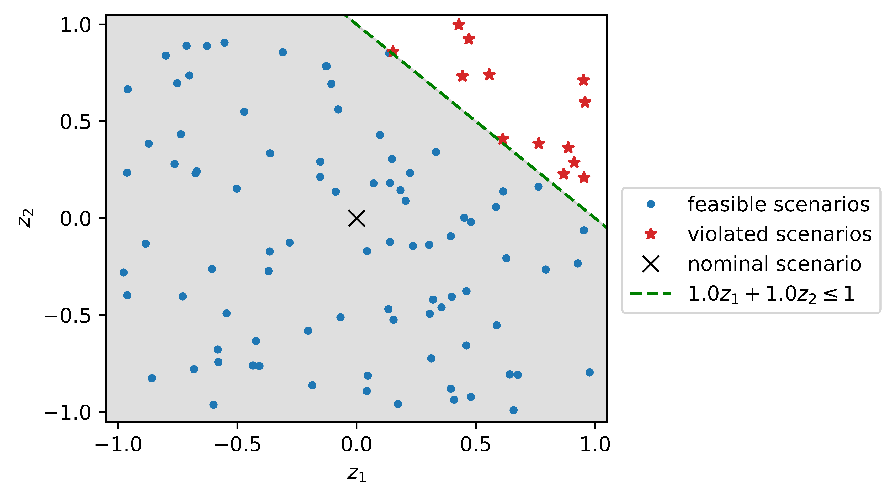
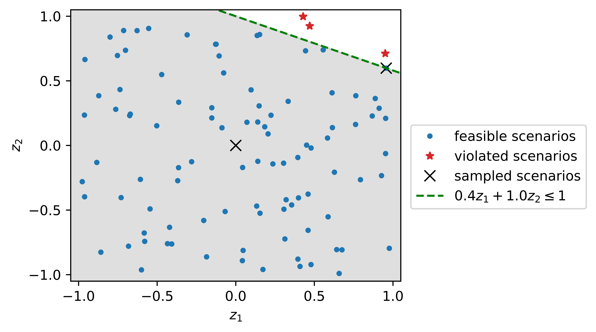
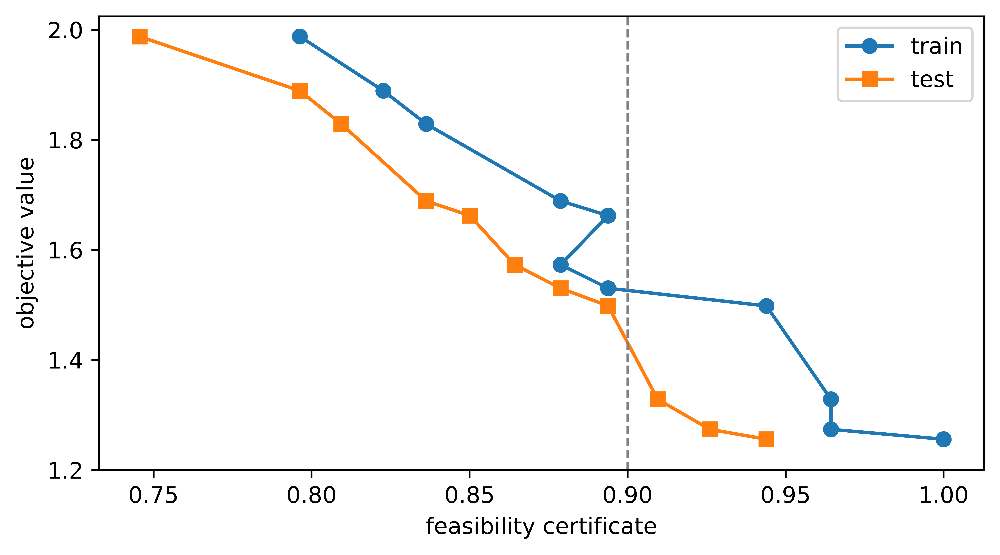

# ROBIST: Robust Optimization by Iterative Scenario Sampling and Statistical Testing

This repository provides the code for applying _ROBIST_, a simple, yet effective, data-driven algorithm for optimization under parametric uncertainty. The method and application are described in detail in an accompanying paper, available online [here](add link). The method was developed by Justin Starreveld, Guanyu Jin, Dick den Hertog and Roger J. A. Laeven.

## Code

The code is written in `Python`, version 3.10.9. The dependency packages are listed in `setup.csg`.

The algorithm itself is coded in "Code/ROBIST.py" and is applied to four different problems:
1) Toy Problem (abbreviated as tp). We compare ROBIST with the methods of Calafiore & Campi (2005) and Yanıkoglu & den Hertog (2013) in  `Code/tp_experiments_cal2005_yan2013.py`. Furthermore we analyze the performance of ROBIST in more detail in `Code/tp_analysis.py` and illustrate the method with the help of `Code/tp_illustrative_plots.py`.

2) Portfolio Management Problem (abbreviated as pm). We compare ROBIST with the data-driven robust optimization approach proposed by Bertsimas et al. (2018) and the scenario optimization approach of Calafiore (2013) in `Code/pm_experiments.py`.

3) Weighted Distribution Problem (abbreviated as wdp). We compare ROBIST with the scenario optimization methods of Calafiore & Campi (2005), Caré et al. (2014), Calafiore (2016) and Garatti et al. (2022) in `Code/wdp_experiments.py`.

4) Two-Stage Lot-Sizing Problem (abbreviated as ls). We compare ROBIST with the method of Vayanos et al. (2012) in `Code/ls_experiments.py`.

For more information about these problems we refer to the [paper](add link).

## Illustrative Example

ROBIST is applied to an illustrative toy problem in Section 2.2 of the paper. The code used to create the figures in this section is available at `Code/tp_illustrative_plots.py`. Examples of such figures are displayed below:

  
  
  

## Contact Information
Our software is not flawless. We welcome any questions or suggestions. Please reach us at j.s.starreveld@uva.nl. 
